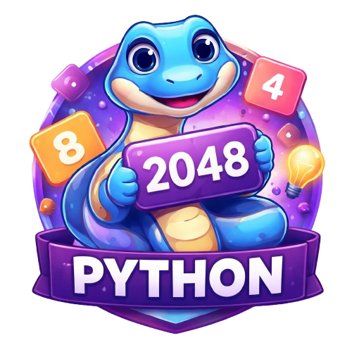

# 2048

A beautiful, animated implementation of the classic 2048 puzzle game built with Python and Tkinter.


<p align="center">
  
</p>

2048 is a single-player sliding tile puzzle game where the objective is to slide numbered tiles on a 4×4 grid to combine them and create a tile with the number 2048. When two tiles with the same number collide, they merge into one tile with their sum. The game is won when a 2048 tile appears on the board, though players can continue beyond this point to achieve higher scores.

This implementation features smooth sliding animations, a clean visual design inspired by the original game, and intuitive keyboard controls.

## Getting Started

### Prerequisites

Python 3.8 or higher is required. Tkinter comes pre-installed with Python on most systems. To verify your installation:

```bash
python --version
python -c "import tkinter; print('Tkinter is available')"
```

### Running the Game

Clone or download this repository, then run:

```bash
python main.py
```

The game window will open centered on your screen, ready to play.

## How to Play

Slide tiles in any of the four directions using your keyboard. When two tiles with the same number touch, they merge into one tile with double the value. After each move, a new tile (either 2 or 4) appears in a random empty spot. Plan your moves carefully to avoid filling the board.

### Controls

| Action | Keys |
|--------|------|
| Move Up | `W` or `↑` |
| Move Down | `S` or `↓` |
| Move Left | `A` or `←` |
| Move Right | `D` or `→` |
| New Game | `R` |
| Continue after win | `Space` |

When the game ends, press any key or click the board to start a new game.

## Project Structure

```
2048/
├── main.py              # Application entry point
├── game/                # Core game logic
│   ├── __init__.py
│   ├── constants.py     # Game configuration (grid size, win condition)
│   ├── board.py         # Board state and tile management
│   └── logic.py         # Movement, merging, and animation tracking
├── ui/                  # User interface components
│   ├── __init__.py
│   ├── app.py           # Main window and event handling
│   ├── game_board.py    # Visual board with animations
│   ├── colors.py        # Color scheme for tiles and UI
│   └── styles.py        # Typography and layout constants
└── storage/
    └── avatar.png       # Window icon
```

## Architecture Overview

The codebase separates concerns into two main packages: game logic and user interface.

### Game Package

The `game` package handles all game mechanics independent of how the game is displayed. The `Board` class maintains the grid state, tracks scores, and provides methods for adding tiles and checking game conditions. The `GameLogic` class processes player moves by merging tiles along rows or columns, calculating scores, and tracking tile movements for animation purposes.

A single move involves copying the current grid state, processing merges in the specified direction, comparing the result to detect changes, spawning a new tile if the board changed, and updating win/lose conditions.

### UI Package

The `ui` package renders the game using Tkinter's Canvas widget. The `GameBoard` class draws tiles as rounded rectangles and handles smooth sliding animations using time-based interpolation with an ease-out curve for natural deceleration.

Animation works by storing tile positions before a move, calculating where each tile needs to travel, then interpolating positions over 100 milliseconds. Static tiles (those that don't move) are drawn immediately while moving tiles animate to their destinations. New tiles appear with a subtle pop effect.

The color scheme follows the original 2048 game aesthetic, with tiles transitioning from cream (2, 4) through orange (8, 16, 32) to gold (128+).

## Customization

### Adjusting Game Settings

Edit `game/constants.py` to change the grid size or winning tile:

```python
GRID_SIZE = 4        # Try 3 for a harder game, 5 for easier
WINNING_TILE = 2048  # Set higher for extended play
```

### Modifying Appearance

The visual style is controlled by two files in the `ui` package:

**colors.py** defines the color palette. Each tile value maps to a background color and text color. The dictionary structure makes it easy to add colors for higher tiles or adjust the existing scheme.

**styles.py** controls dimensions and typography. Change `CELL_SIZE` to make tiles larger or smaller, adjust `CELL_PADDING` for spacing, or modify `ANIMATION_DURATION` (in milliseconds) to speed up or slow down tile movements.

## Development Notes

The animation system tracks tile movements using the `TileMove` class, which stores source position, destination position, and tile value. When processing a move, the logic calculates which tiles travel where, allowing the UI to animate each tile independently.

Merging is handled by processing one row or column at a time. The algorithm removes empty cells, pairs adjacent equal values, combines them, and pads with zeros. The `reverse` parameter allows the same function to handle all four directions by reversing input and output for right/down movements.

The Tkinter Canvas uses tags to manage different element types: "background" for empty cell slots, "tile" for static tiles, "animated" for moving tiles, "static" for tiles that stay in place during animation, and "overlay" for game over and win screens.

## License

This project is open source and available under the MIT License.
